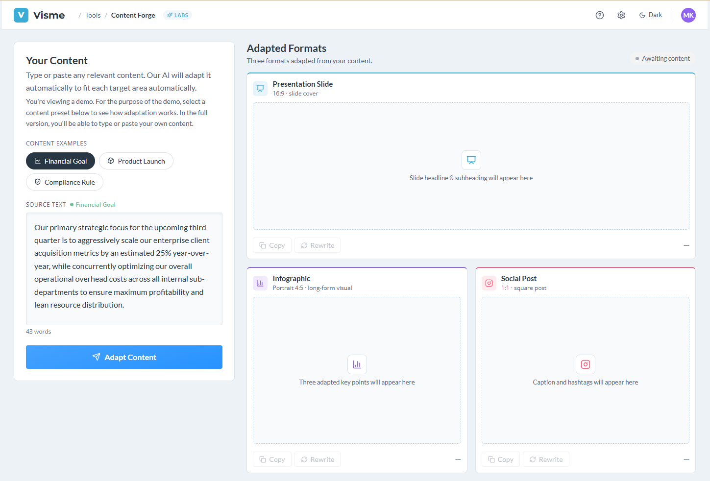

# Visme — Content Forge

A concept demo that transforms a single content brief into three adapted visual formats — presentation slide, infographic, and social post — built with Visme's design system.



---

## What it does

Content Forge takes a source brief and adapts it into three output surfaces simultaneously:

| Surface | Aspect ratio | Output |
|---|---|---|
| **Presentation Slide** | 16:9 | Headline + subheading for a slide cover |
| **Infographic** | 4:5 (portrait) | Three distilled key points |
| **Social Post** | 1:1 (square) | Caption with hashtags |

Each surface ships with three rewrite variants. Hit **Rewrite** on any card to cycle through alternatives, or **Copy** to grab the content to clipboard.

Three demo content categories are included: Financial Goal, Product Launch, and Compliance Rule.

---

## Running it

No build step. Open `content-forge.html` directly in a browser.

```
open content-forge.html
```

React 18, Babel standalone, and Lucide icons are loaded from CDN — no `npm install` needed.

---

## Design system

The `visme-design-system/` folder contains a design system synthesized from Visme's own product surfaces (`visme.co`, `dashboard.visme.co`, `my.visme.co`):

| File | Contents |
|---|---|
| `tokens.json` | Design tokens in DTCG format — colors, typography, spacing, radii, shadows |
| `variables.css` | CSS custom properties ready to `@import` |
| `tailwind.config.js` | Tailwind theme extension mapping tokens to utility classes |
| `DESIGN.md` | Full reference: color palette, type scale, component anatomy, do's and don'ts |

The app itself uses these tokens end-to-end. All colors reference CSS custom properties, so dark mode is a single `data-theme="dark"` attribute flip with no JavaScript-driven style overrides.

### Brand palette used

| Token | Hex | Role |
|---|---|---|
| Sky | `#3CACD7` | Brand primary — links, icons, accents |
| Blue | `#2693FF` | App action primary — buttons, active states |
| Navy | `#293745` | Body text, dark surfaces |
| Green | `#6CC395` | Success states |
| Purple | `#9062F0` | Premium / infographic accent |
| Coral | `#fa607e` | Social post accent |

### Typography

- **Lato** — universal body font
- **Montserrat** — display headings and brand marks
- **Open Sans** — labels, captions, secondary UI text

---

## Features

- **Dark / light theme** — toggle in the header, persisted to `localStorage`, applied before first paint to prevent flash
- **Responsive layout** — two-column at ≥960px, single-column below
- **Staggered card reveal** — surfaces animate in with a cascade on adapt
- **Accessible markup** — ARIA roles, `aria-live` regions for status pills and toasts, keyboard focus rings using brand colors
- **Copy to clipboard** — per-surface copy with a confirmation toast
- **Rewrite variants** — three pre-written options per surface, cycling on demand

---

## File structure

```
visme-demo/
├── content-forge.html          # App entry point — React app compiled in-browser via Babel
├── content_forge.css           # Shared component styles (cards, buttons, icon buttons)
├── content_forge_data.js       # Static data module — surfaces, categories, timing constants
└── visme-design-system/
    ├── tokens.json             # Design tokens (DTCG format)
    ├── variables.css           # CSS custom properties
    ├── tailwind.config.js      # Tailwind theme extension
    └── DESIGN.md               # Full design system reference
```

---

## Tech

- HTML5 · Vanilla CSS · React 18 (CDN) · Babel standalone (no build)
- [Lucide Icons](https://lucide.dev/) · Google Fonts
- Zero dependencies, zero build tooling
